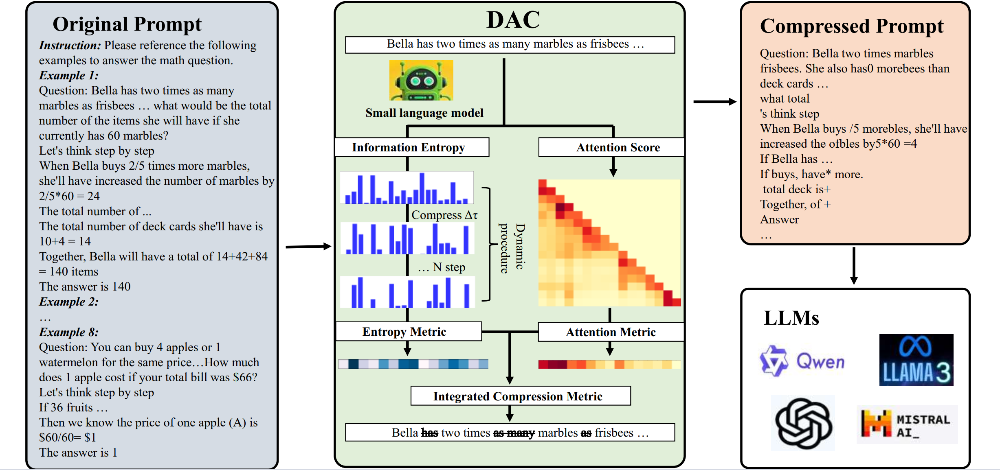

# 📄 DAC: A Dynamic Attention-aware Approach for Task-Agnostic Prompt Compression  
[](https://arxiv.org/abs/2507.11942)
[](https://aclanthology.org/2025/)
[](LICENSE)

> **Official repository for DAC: A Dynamic Attention-aware Approach for Task-Agnostic Prompt Compression**  
> 🔧 Enhancing prompt efficiency through dynamic attention-aware compression  
> 📄 Accepted at **ACL 2025**  
> 🌐 [arXiv Paper](https://arxiv.org/abs/2507.11942) | 💾 [Code on GitHub](https://github.com/QQQ-yi/DAC)

---

### ✨ Overview

We introduce DAC, a dynamic attention-aware method for task-agnostic prompt compression. DAC jointly models attention weights and dynamic entropy changes to iteratively preserve the most informative tokens, effectively reducing input length and improving LLM efficiency and performance.

📄 **Paper Link**: [https://arxiv.org/abs/2507.11942](https://arxiv.org/abs/2507.11942)

### 🖼️ Framework




---

## 🛠️ 2. Environment Setup

This project uses `conda` to manage dependencies. You can easily reproduce the environment using the provided `environment.yml`.

```bash
# Clone the repository
git clone https://github.com/QQQ-yi/DAC.git
cd DAC

# Create and activate the conda environment
conda env create -f environment.yml
conda activate DAC
```

## ▶️ 3. How to Run

### 🚀 Quick Start

```python
from compressor import PromptCompressor

# Initialize the compressor (supports Hugging Face models)
model_name = "Qwen/Qwen2-0.5B-Instruct"
compressor = PromptCompressor(model_name)

# Long input context (e.g., retrieved documents, conversation history)
context = """
Artificial intelligence is a branch of computer science aimed at creating systems capable of performing tasks that typically require human intelligence...
"""

# Perform compression
result = compressor.compress(
    context=context,
    compress_ratio=0.9,                     # Keep only 10% of tokens (10x compression)
    method="dynamic_attn_ppl",              # Compression method
    fusion="additive",                      # Fusion strategy
    alpha=0.8,                              # Attention weight in additive fusion
    dyn_time=10,                            # Number of dynamic iterations
    preserve_punct=False,                   # Preserve punctuation and special tokens or not
    return_info=True                        # Return detailed info
)

# Output results
print("Compressed text:", result["compressed_text"])
print("Original tokens:", result["original_tokens"])
print("Compressed tokens:", result["compressed_tokens"])
print("Actual compression ratio:", result["actual_ratio"])
```


## 📚 4. Citation


```bibtex
@misc{zhao2025dac,
      title   = {DAC: A Dynamic Attention-aware Approach for Task-Agnostic Prompt Compression}, 
      author  = {Yi Zhao and Zuchao Li and Hai Zhao and Baoyuan Qi and Guoming Liu},
      year    = {2025},
      eprint  = {2507.11942},
      archivePrefix = {arXiv},
      primaryClass  = {cs.CL},
      url     = {https://arxiv.org/abs/2507.11942}
}